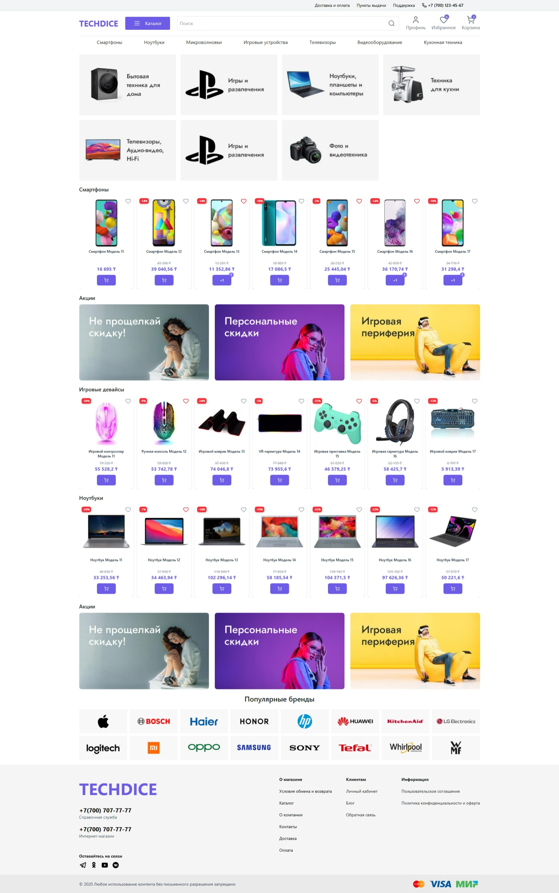
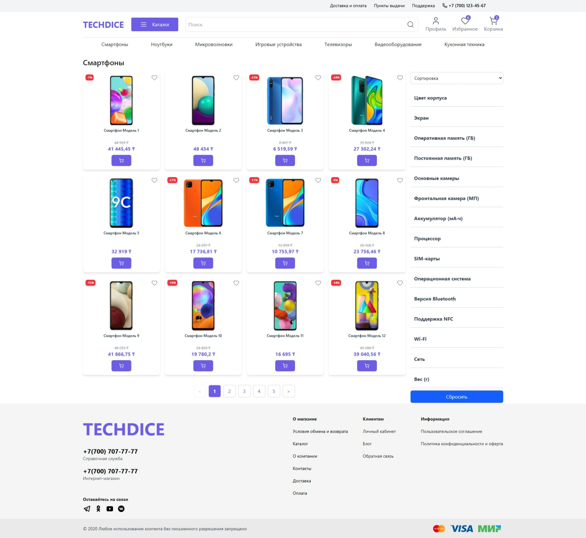
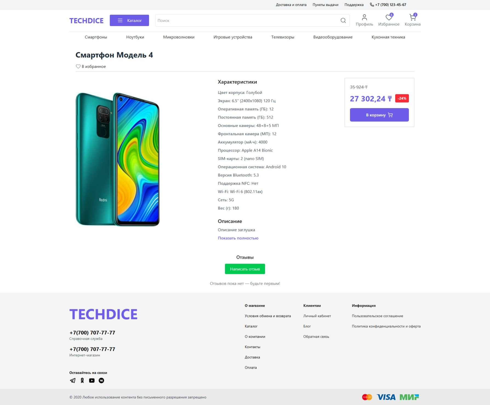
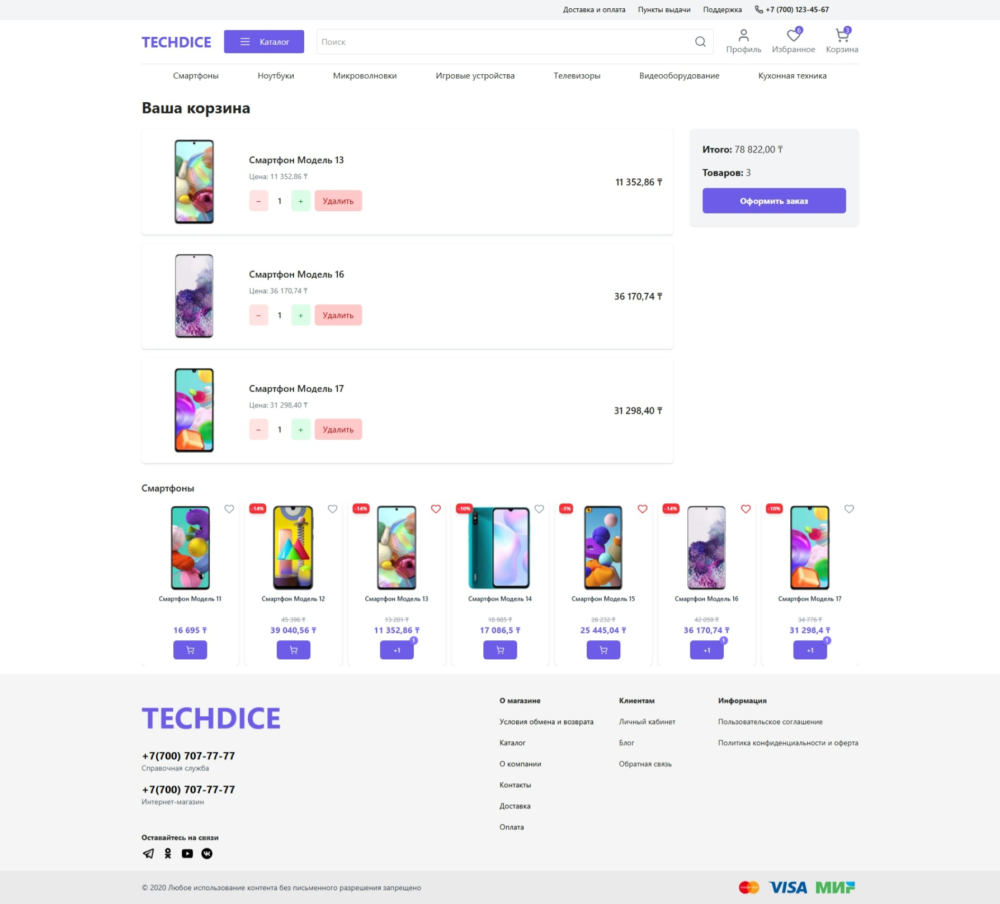
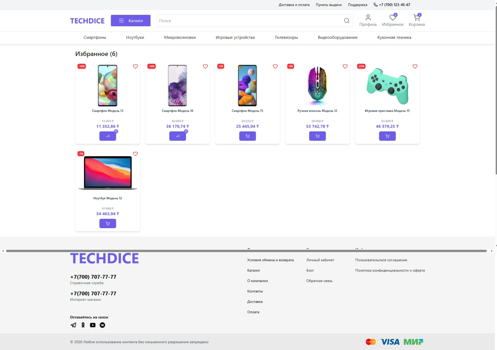

# 🛒 Магазин разнообразной техники  


## 📌 Описание  
Учебный fullstack-проект: интернет-магазин бытовой и компьютерной техники.  
Фронтенд реализован на **React + TypeScript**, бэкенд — на **GraphQL API**.  
Поддерживает регистрацию, авторизацию, каталог товаров, корзину и адаптивную вёрстку.  

## 🚀 Деплой  
🔗 [Открыть проект](https://diplomprojectv2.onrender.com/)  

*(В бесплатном тарифе запуск может занимать несколько секунд)*  

## 📸 Скриншоты  

### 🏠 Главная страница  
  

### 📑 Каталог товаров  
  

### 📦 Страница товара с отзывами  
  

### 🛒 Корзина  
  

### ⭐ Избранные товары  
  

## ✨ Функционал  

- 📑 Каталог товаров с категориями (кухонная техника, ноутбуки, игровые устройства и т. д.)  
- 🔍 Поиск и фильтрация по категориям  
- 📊 Пагинация и сортировка списка товаров  
- 🛒 Добавление и удаление товаров в корзину  
- 🔐 Регистрация и авторизация пользователей (JWT)  
- 📱 Адаптивная вёрстка  
- 🎨 Анимации интерфейса (Framer Motion)  

## 🛠️ Технологии  

- **React 19 + TypeScript 5.8**  
- **Vite 7**  
- **Redux Toolkit**  
- **Apollo Client (GraphQL)**  
- **TailwindCSS + SCSS**  
- **React Router DOM**  
- **React Hook Form + Yup**  
- **Framer Motion**  
- **Swiper**  
- **Vitest + Testing Library**  

## 📦 Установка и запуск  

⚠️ Для полноценной работы приложения требуется запущенный GraphQL backend.  
Инструкции по установке находятся в репозитории [backend](https://github.com/DieDice13/DiplomProjectV2-backend).  

```bash
# Клонируем репозиторий проекта
git clone https://github.com/DieDice13/DiplomProjectV2

# Переходим в папку с проектом
cd project-name

# Устанавливаем зависимости
npm install
# или
pnpm install

# Запускаем локальный сервер разработки
npm run dev
```

## 🔮 Планы по развитию

💳 Интеграция онлайн-оплаты (Stripe/PayPal)

👤 Личный кабинет пользователя с историей заказов

🛠 Панель администратора для управления товарами

📦 Оформление заказов с доставкой
